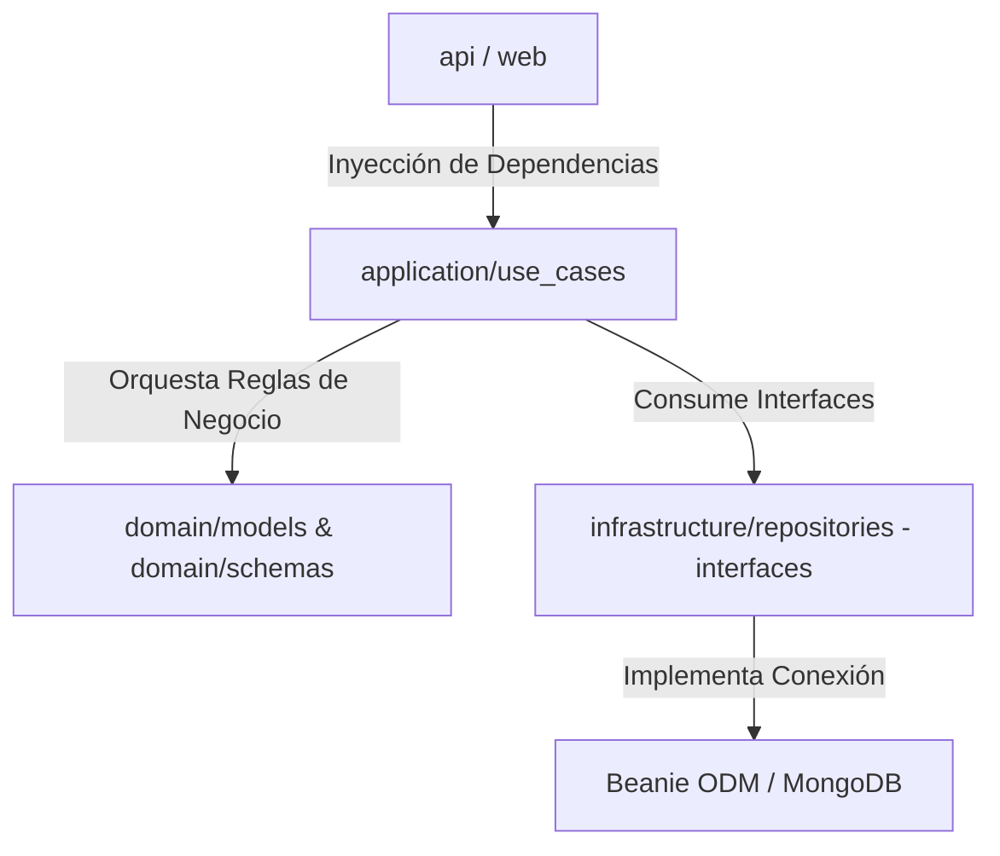
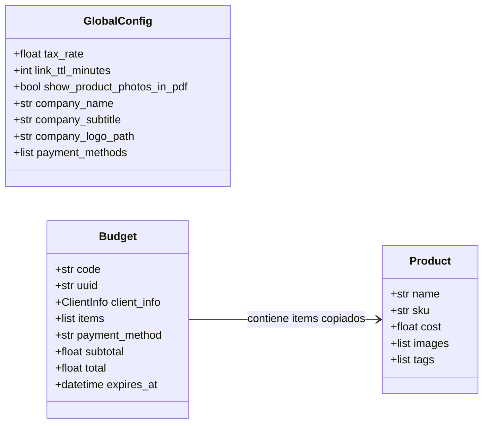

# Architecture Spine — budget_maker

## Design Paradigm

El sistema se rige bajo el paradigma de **Clean Architecture**, con una separación estricta de responsabilidades organizada en las siguientes capas de directorios dentro de `app/`:

* `domain/`: Reglas de negocio empresariales. Contiene las entidades persistentes (modelos de Beanie en `domain/models/`) y las estructuras de validación de datos (schemas Pydantic en `domain/schemas/`). No tiene dependencias externas excepto Pydantic y Beanie.
* `application/`: Casos de uso de la aplicación (`application/use_cases/`). Coordina el flujo de datos hacia y desde las entidades de dominio. No depende de routers de presentación ni frameworks de API.
* `infrastructure/`: Adaptadores externos y servicios. Contiene la implementación de los repositorios de acceso a MongoDB (`infrastructure/repositories/`) y adaptadores para WeasyPrint u openpyxl (`infrastructure/services/`).
* `api/` y `web/`: Capa de presentación y entrega. Define los routers REST de FastAPI, inyección de dependencias (`api/dependencies.py`) y las vistas HTML con Jinja2.



## Invariants & Rules

### AD-1 — Configuración Global como Documento Único y Tipado
- **Binds:** `GlobalConfig`, `config_use_cases`
- **Prevents:** Descoordinación de tipos, lecturas de claves no validadas y fragmentación de parámetros globales en base de datos.
- **Rule:** El modelo `GlobalConfig` en MongoDB debe representarse como un único documento fuertemente tipado (no clave-valor plano) que contenga la tasa de impuesto, el TTL de los links, el flag de visibilidad de fotos, los campos del membrete (título, subtítulo, ruta del logo) y la lista dinámica de métodos de pago.

### AD-2 — Lógica del Buscador Parcial por Expresiones Regulares
- **Binds:** `ProductRepository`, buscador de catálogo
- **Prevents:** Fallos en la detección de subcadenas causados por las limitaciones de coincidencia exacta de los índices de texto de MongoDB.
- **Rule:** La búsqueda parcial e interactiva de productos debe implementarse en la consulta de base de datos usando expresiones regulares (`$regex`) con la opción `"i"` (case-insensitive) sobre los campos SKU, Nombre y Tags. Búsqueda por múltiples tags debe aplicar lógica lógica OR.

### AD-3 — Almacenamiento de Imágenes y Rutas Relativas
- **Binds:** Carga multimedia, `Product`
- **Prevents:** Acoplamiento duro a rutas locales que impida la migración a la nube (AWS S3/Azure Storage) en el futuro, o almacenamiento excesivo de binarios (Base64) en base de datos.
- **Rule:** El backend expone un endpoint multipart dedicado (`POST /api/v1/media/upload`). Este endpoint guarda los archivos físicamente en `/uploads` local y retorna la ruta relativa en formato string (ej: `/uploads/file.png`). El modelo `Product` almacena estas rutas relativas en la lista `images`.

### AD-4 — Invariabilidad de Costos en Presupuestos
- **Binds:** `Budget`, `BudgetUseCases`
- **Prevents:** Cambios retroactivos en presupuestos ya emitidos debido a la actualización de precios de productos en el catálogo o cambios en la tasa de impuesto global.
- **Rule:** Todos los costos, tasas de impuestos y subtotales calculados al momento de generar el presupuesto se persisten de forma inmutable dentro del documento `Budget`. El presupuesto nunca debe consultar dinámicamente el catálogo para recalcular totales históricos en tiempo de visualización.

### AD-5 — Expiración de Links Efímeros
- **Binds:** `Budget`, visor público de cotizaciones
- **Prevents:** Acceso a links de cotización obsoletos que rompan el tiempo de validez configurado por el comercio.
- **Rule:** El modelo `Budget` calcula y guarda el timestamp exacto de caducidad `expires_at` en base al TTL de configuración global al momento de la creación. La API de visualización de presupuestos evalúa si `expires_at < utcnow()` para retornar un error HTTP 410 Gone / 404 Not Found.



## Consistency Conventions

| Concern | Convention |
| --- | --- |
| Naming (entities, files, interfaces) | snake_case para variables, nombres de archivos y funciones en Python. PascalCase para clases y modelos Beanie/Pydantic. |
| Data & formats | Identificadores internos como `PydanticObjectId` (Beanie). Identificadores públicos de presupuestos como UUID4 en formato hexadecimal. Fechas UTC estrictas en formato ISO 8601 o datetimes con zona horaria UTC (`timezone.utc`). |
| State & cross-cutting | Operaciones de persistencia y servicios externas son asíncronas de extremo a extremo (`async` / `await`). Registro de logs mediante logger por módulo: `logger = logging.getLogger(__name__)`. Docstrings y comentarios escritos obligatoriamente en español. |

## Stack

| Name | Version |
| --- | --- |
| Python | 3.11+ |
| FastAPI | 0.115.* |
| Beanie ODM (MongoDB) | 1.26.* |
| Motor (async driver) | 3.5.* |
| WeasyPrint (PDF render) | 62.* |
| pytest (testing framework)| 7.x+ |

## Structural Seed

```text
{root}/
  app/
    api/              # Controladores REST de FastAPI e inyección de dependencias
    application/      # Lógica de negocio pura (Use Cases)
    domain/           # Modelos de dominio (Beanie) y esquemas de datos (Pydantic)
    infrastructure/   # Implementación de repositorios y servicios externos (PDF/Excel)
    database.py       # Inicialización y registro de modelos en Beanie
  web/                # Frontend MVP (Jinja2 templates y archivos estáticos)
  tests/              # Pruebas automatizadas (pytest) que simulan la conexión con MongoDB local
```

## Deferred
- Autenticación, control de accesos por roles y seguridad perimetral de endpoints (AD pospuesta para la fase de producción).
- Pasarela de cobros / pago real (AD pospuesta; los métodos de pago registrados en cotizaciones son de carácter estrictamente informativo).
